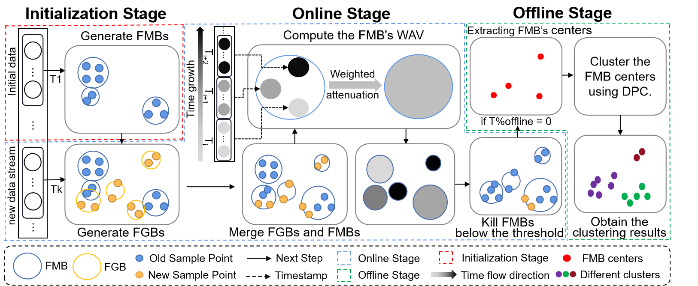

# GB-FuzzyStream
Taking inspiration from multi-granularity cognitive learning, we have designed an efficient fuzzy stream clustering approach with multi-granularity representation using granular-ball computing model. Alleviated the problem of cluster boundary overlap caused by concept drift.
## Algorithmic Processes

1. In the initialization stage, fuzzy micro-balls are generated.
2. in the online phase, the algorithm generate fuzzy granular-balls using the incoming data. These fuzzy granular-balls will be merged with fuzzy micro-balls, and then updating the weights of the fuzzy micro-balls. These fuzzy micro-balls with weights below the threshold will be removed, and it is determined whether to transition to the offline phase.
3. In the offline phase, the centers of fuzzy micro-balls are utilized as inputs for DPC algorithm, thus obtaining the clustering results.
## Files
These program mainly containing: 
**data**: The folder where the dataset is stored. 
**mine**: Algorithm code file. 

- **main**: The algorithm starts from here.

**notebooks**: Stores resources related to markdowm files, independent of algorithms.

## Requirements
### Dataset Format
The format is csv, the last column of data is the timestamp
and the penultimate column is the label.

## Usage
The current sample dataset is RBF3 from the paper, where the parameter **λ** is 1 and the **threshold** is 0.3, **ρ\***= 0.5, **δ\*** = 0.5.

**λ** and **threshold** are set in the mine/MBStream, and **ρ\*** and **δ\*** are set in the mine/DPC (find_centers_auto) function.

